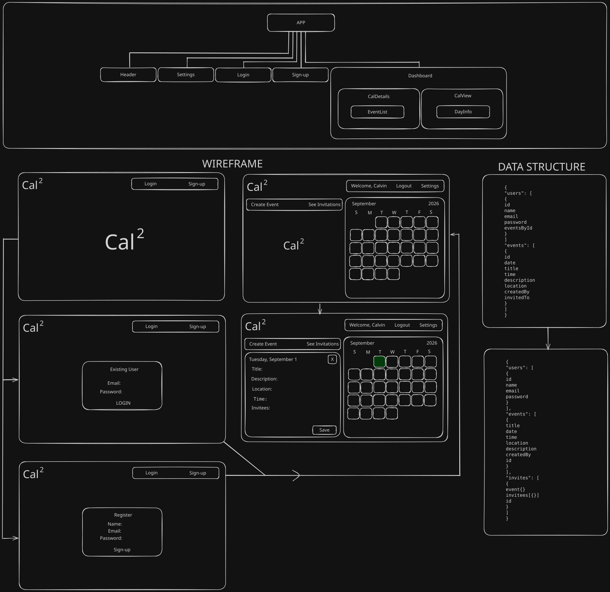

# Front-End Assessment

### Calvin Millett -- Cal<sup>2</sup>
Cal<sup>2</sup> is a calendar web-application created by Calvin Millett. It is built on React with Vite, TypeScript, and Tailwind CSS. Cal<sup>2</sup> uses [json-server](https://www.npmjs.com/package/json-server) in order to locally host a backend. 

### Features
- Account creation
- Account management
- Account authentication
- Full calendar view
- Event management
- Invite support

### Usage
1. Clone this repository:
```sh
git clone https://github.com/Thrivent-ETS-Cohort-2026/cmillett-calendar
```
2. Change directory:
```sh
cd cmillett-calendar/
```
3. Run Vite:
```sh
npm run dev
```
4. In a second terminal window, ensure you are in `cmillett-calendar/`, start json-server:
```sh
npx json-server src/data/db.json
```
5. In your browser, navigate to this link:
```
http://localhost:5173/
```

## Project Outline
